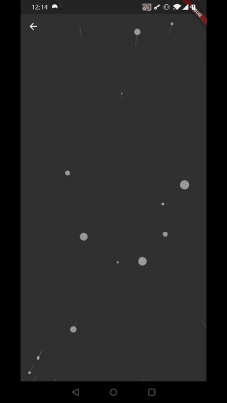
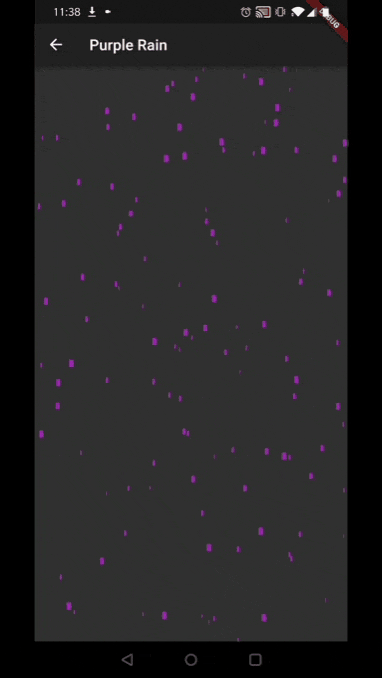
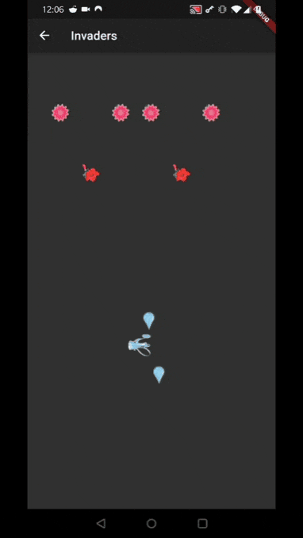
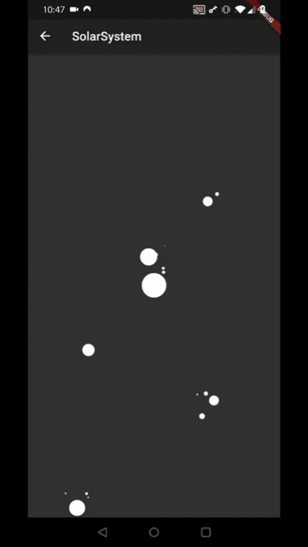
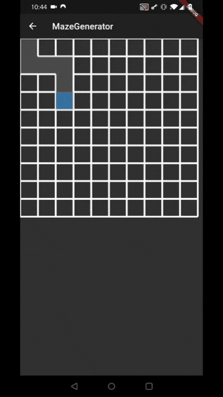
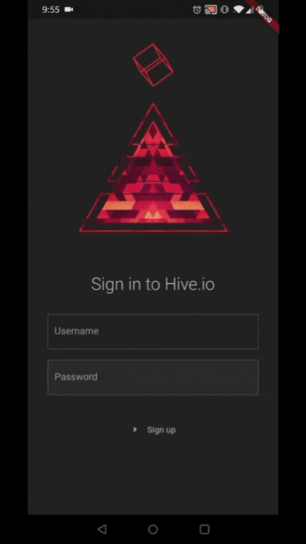

See also my [Flutter design recreations](https://github.com/Nolence/flutter_designs)

# Walkers

Animations of several walkers with various noises:
 * symplex
 * random
 * perlin
 * straight

# Fractals
Animations of several fractal algorithms and transformation angles:

# Bubbles
Popping Bubbles!

# Starfield
Next challenge in this category is to do the [universe](https://www.youtube.com/watch?v=ZZY9YE7rZJw&t=0s)!

# Snake Game
A Snake (Worm) Game with custom drawn d-pad, a finite state machine and some red apples. No external game engine was used (E.g., no Flame).

# Purple Rain

# Invaders
This hosts three levels and a full loaded watering can

# Solar System

# Maze Generation

# Terrain Generation Music Player

# Rotating Cube Login Page

